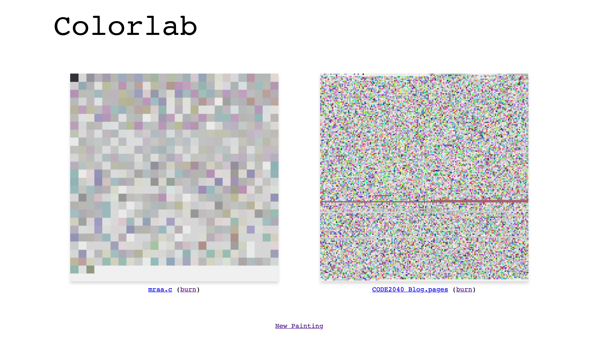

#ColorLab
A Rails App with a Python script that turns any file into art. The images are stored on S3.

The App requires the following environment variables defined:  
**COLORLAB\_ACCESS\_KEY\_ID** *(AWS Access Key)*  
**COLORLAB\_SECRET\_ACCESS\_KEY** *(AWS Access Secret)*  
**COLORLAB\_BUCKET\_BASE\_URL** *(http://abcxyz.s3.amazonaws.com/)*  

##Screenshot

